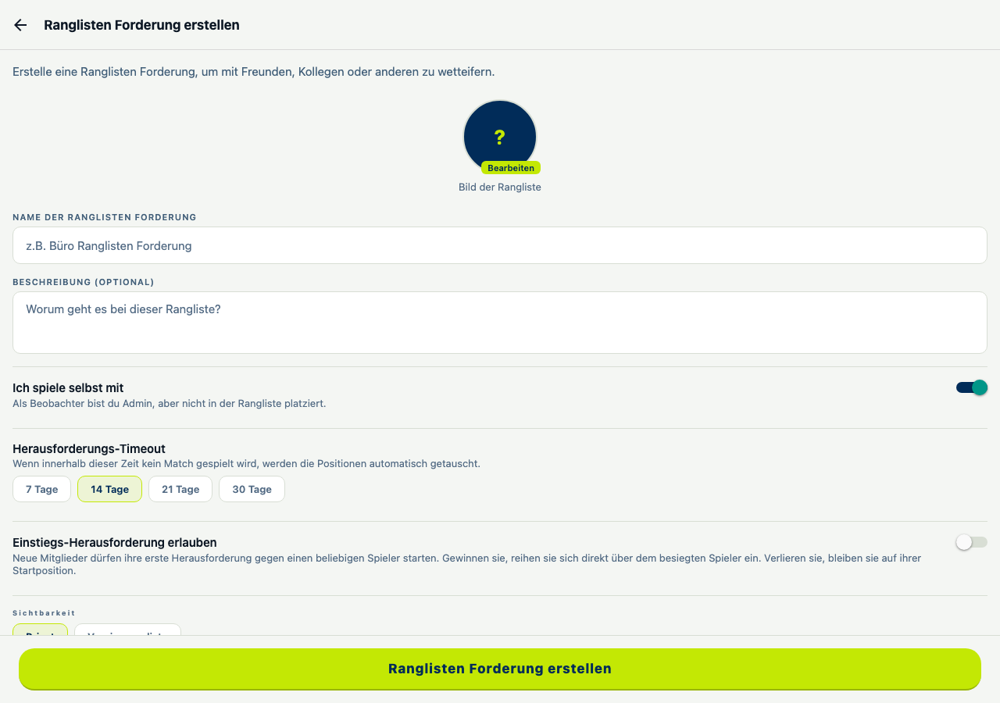
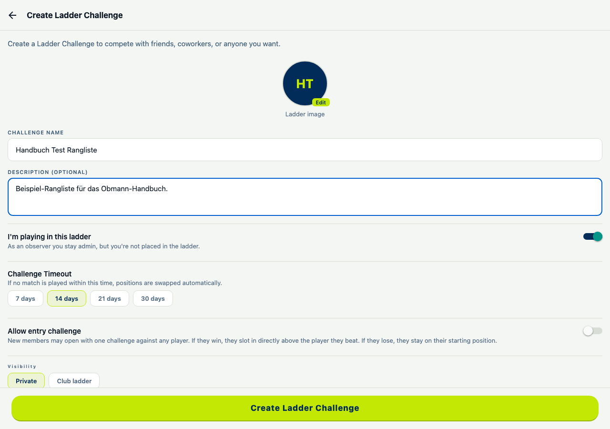
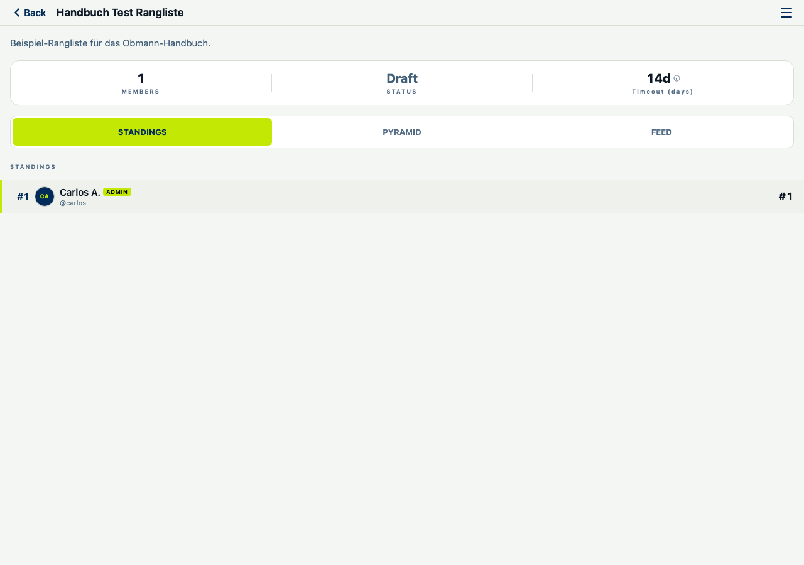
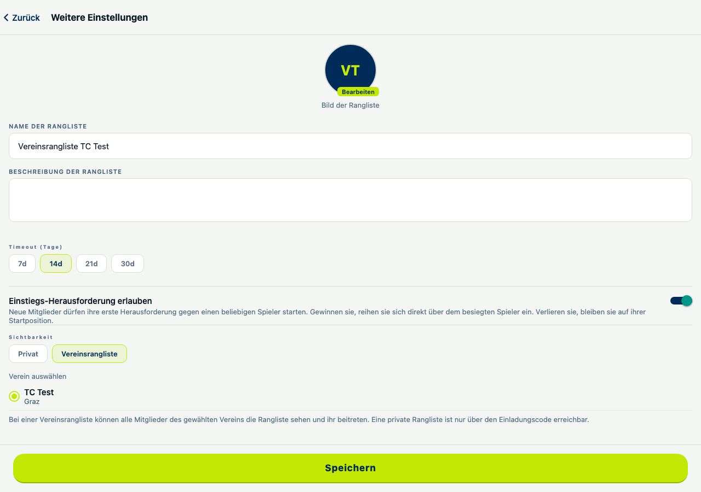
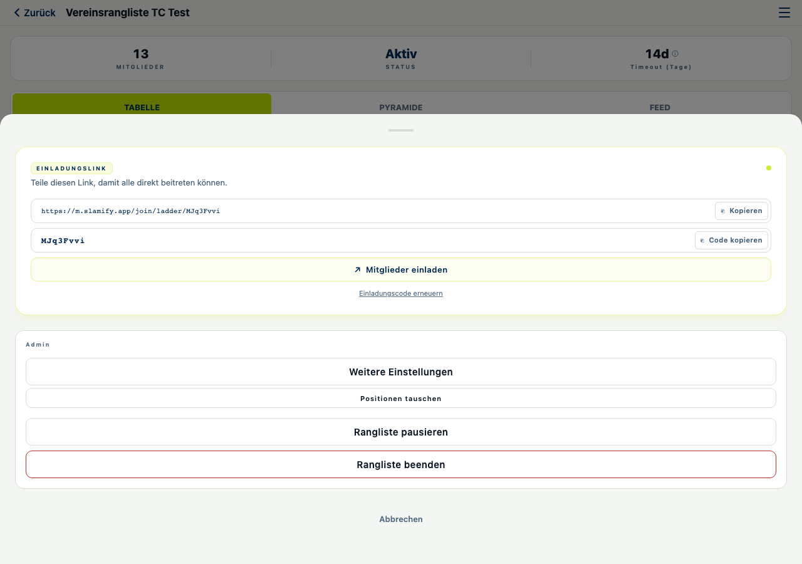
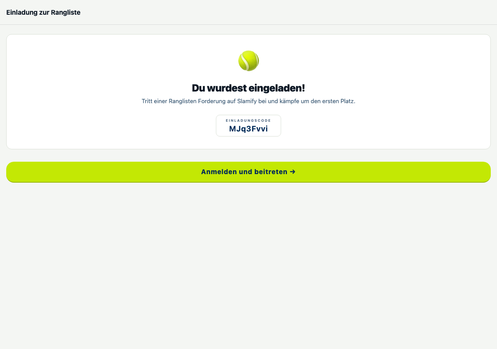
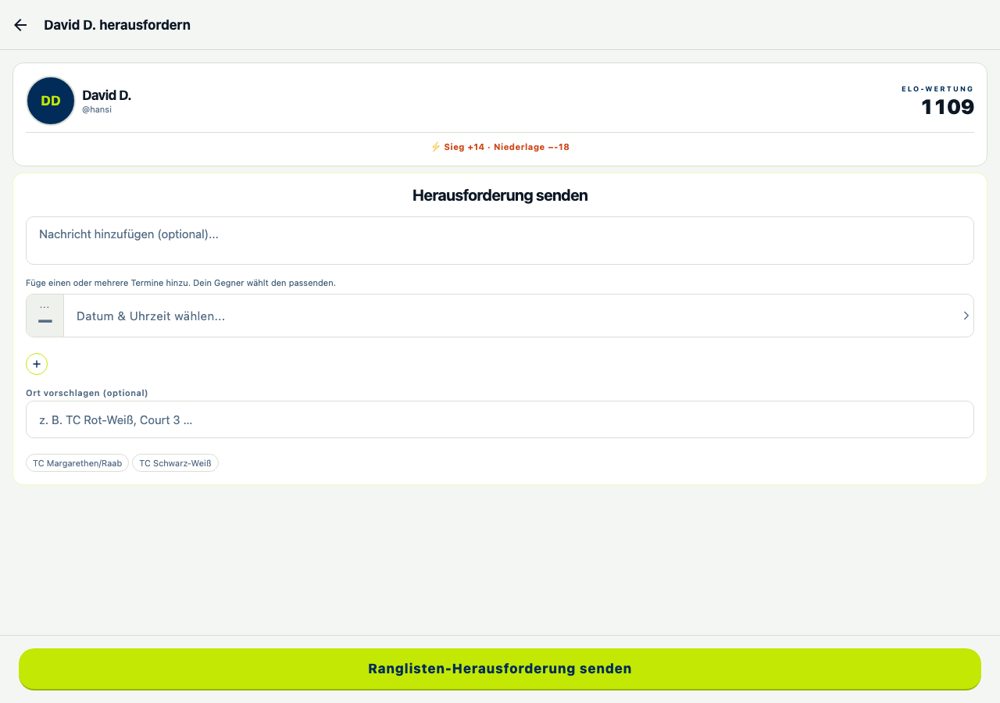
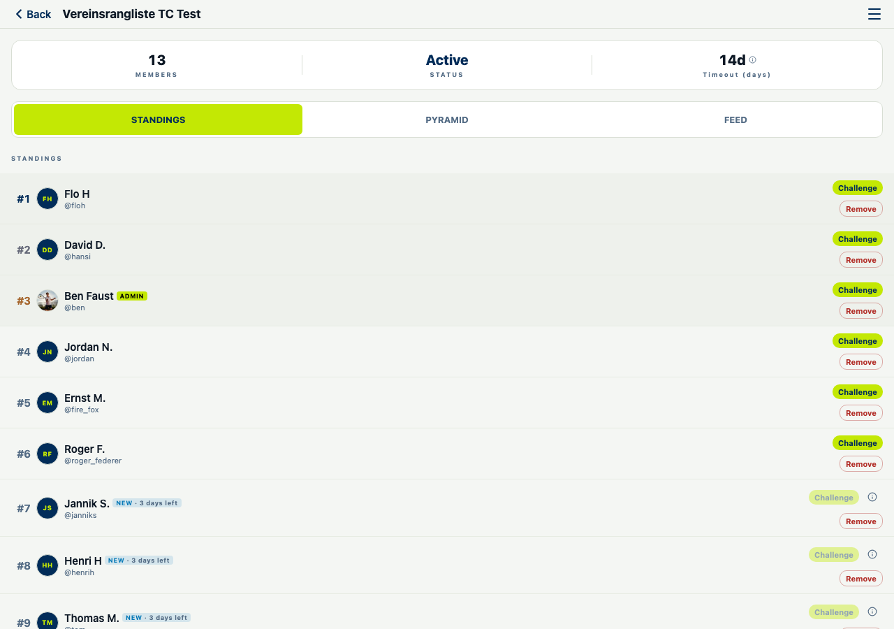
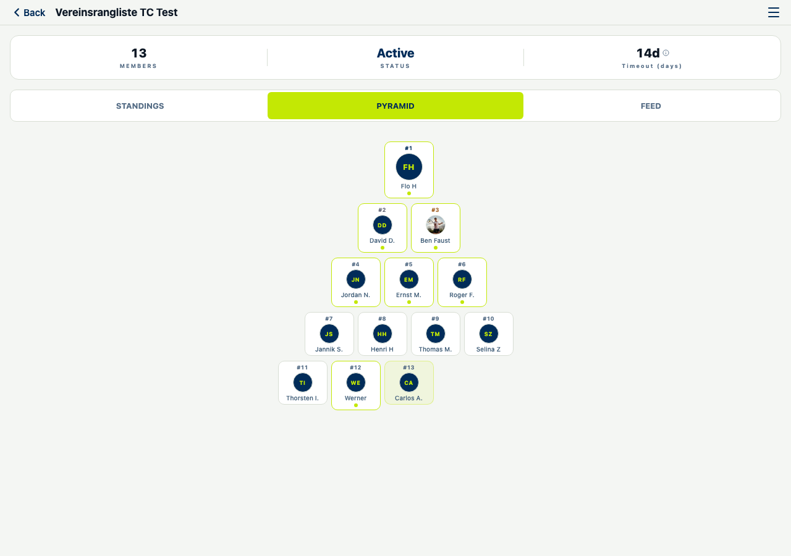
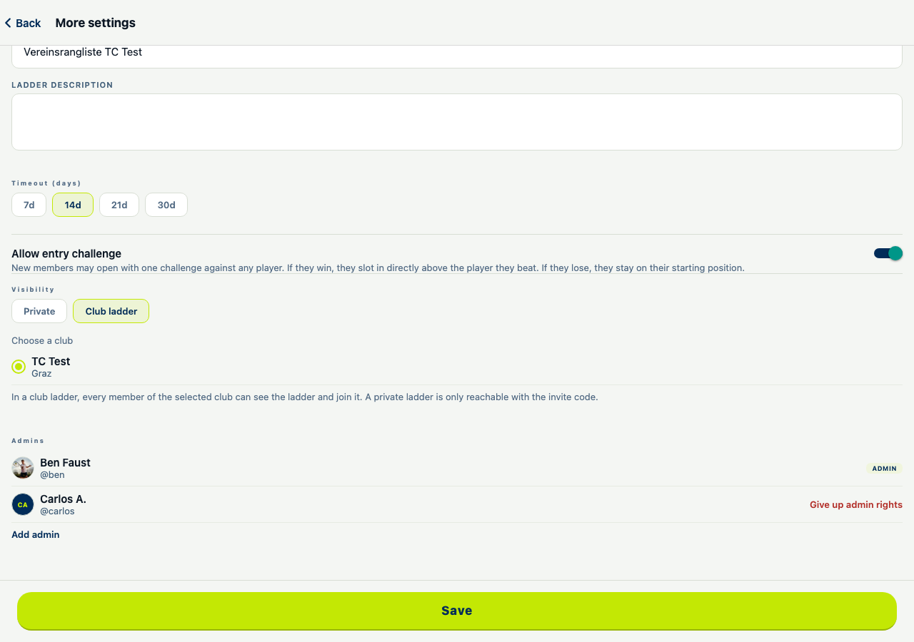

# Ranglisten-Handbuch für Obmänner

Kurzanleitung für Vereins-Obmänner und -Obfrauen, die in Slamify eine Rangliste (Ladder) für ihren Verein anlegen und verwalten wollen.

Die Screenshots zeigen die App mit auf Deutsch gestellter Sprache (umstellbar unter Profil → Einstellungen → Sprache).

## 1. Rangliste erstellen

Über "Ranglisten Forderung erstellen" legst du eine neue Rangliste an:

- **Name der Ranglisten Forderung / Beschreibung** – Name und kurze Beschreibung der Rangliste.
- **Bild der Rangliste** – optionales Vereins- oder Ranglisten-Logo.
- **"Ich spiele selbst mit"** – ein/aus, je nachdem ob du selbst mitspielst oder nur als Admin/Beobachter verwaltest.
- **Herausforderungs-Timeout** (7 / 14 / 21 / 30 Tage) – wird eine Herausforderung in diesem Zeitraum nicht gespielt, werden die Positionen automatisch getauscht.
- **Einstiegs-Herausforderung erlauben** – neue Mitglieder dürfen direkt eine Herausforderung gegen einen beliebigen Spieler starten; gewinnen sie, rutschen sie direkt über diesen Spieler.
- **Sichtbarkeit** – `Privat` (nur über Einladungslink/-code erreichbar) oder `Vereinsrangliste` (für alle Mitglieder des gewählten Vereins sichtbar und beitretbar).

## 2. Einstellungen anpassen

Über das Burger-Menü → **"Weitere Einstellungen"** lassen sich dieselben Felder wie bei der Erstellung jederzeit ändern: Name, Beschreibung, Timeout, Einstiegs-Herausforderung, Sichtbarkeit und (bei Vereinsrangliste) der zugeordnete Verein.

## 3. Mitglieder einladen (Beitritt)

Im Burger-Menü findest du den **Einladungslink** und den **Einladungscode** zum Teilen (Kopieren / Code kopieren / Mitglieder einladen / Einladungscode erneuern).

So sieht die Einladung für einen neuen, noch nicht eingeloggten Spieler aus, wenn er den Link öffnet:

## 4. Eine Herausforderung erstellen

Jedes Mitglied kann über die Tabellenansicht ("Herausfordern"-Button neben einem Namen) eine Herausforderung gegen einen anderen Spieler starten: optionale Nachricht, ein oder mehrere Terminvorschläge (der Gegner wählt den passenden aus) und optional ein Spielort.

## 5. Ansicht "Tabelle"

Die Standardansicht zeigt die Rangliste als Tabelle: Platz, Name, ggf. Admin-Kennzeichnung, "NEU"-Badge mit verbleibenden Tagen für neue Mitglieder mit Entry-Challenge-Recht, sowie Herausfordern-/Entfernen-Buttons.

## 6. Ansicht "Pyramide"

Alternative, visuelle Darstellung derselben Rangliste als Pyramide – eignet sich gut zum Aushang im Verein.

## 7. Admins verwalten

Es gibt **keine eigene Admin-Seite** – die Admin-Verwaltung ist der untere Teil derselben "Weitere Einstellungen"-Seite aus Punkt 2. Dort werden die aktuellen Admins gelistet (inkl. "Admin-Rechte abgeben") und neue Admins über "Admin hinzufügen" ergänzt.

---

*Screenshots aufgenommen von QA auf `test-m.slamify.app`, Stand Oktober 2026.*
